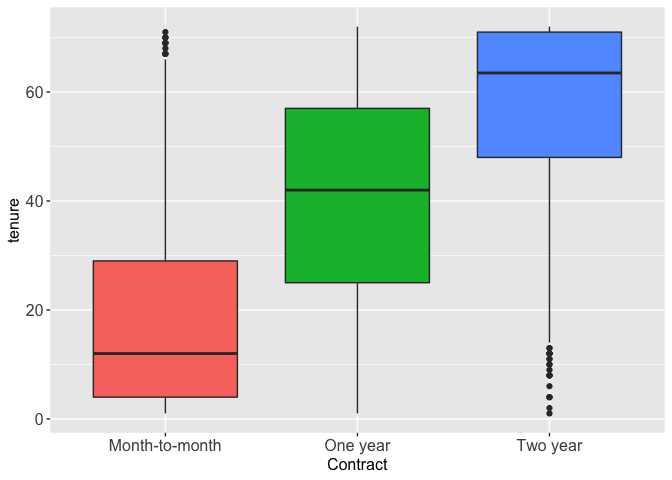

Exploratory Data Analysis
================

This section of the project will focus on exploratory data analysis.
After examining and performing any necessary data cleaning, I visualized
the variables and their relationships to determine whether or not they
will be useful in predicting customer churning.

**Key Findings**:

-   After data cleaning, the finalized training set contains 1995
    observations with 20 variables
-   The response variable, **churn**, has a prevalence of 27.3%
-   Customers who have a higher monthly charge and lower tenure tend to
    churn more.
-   Customers who are not senior citizens, have partners, have
    dependents, or don’t use electronic checks are less likely to churn.
-   Although customers with the *Fiber Optic* internet service are more
    likely to churn, it’s due to the higher cost of that specific
    service rather than the quality of its services.
-   Customers with online security, online backup, device protection,
    and tech support are less likely to churn regardless of the cost and
    their internet service.

### Table of Contents

-   <a href="#1-introduction" id="toc-1-introduction">1. Introduction</a>
    -   <a href="#11-loading-packages" id="toc-11-loading-packages">1.1 Loading
        Packages</a>
    -   <a href="#12-importing-the-data" id="toc-12-importing-the-data">1.2
        Importing the Data</a>
-   <a href="#2-data-cleaning" id="toc-2-data-cleaning">2. Data Cleaning</a>
    -   <a href="#21-viewing-the-data" id="toc-21-viewing-the-data">2.1 Viewing
        the Data</a>
    -   <a href="#22-missing--duplicate-values"
        id="toc-22-missing--duplicate-values">2.2 Missing &amp; Duplicate
        Values</a>
    -   <a href="#23-data-preparation" id="toc-23-data-preparation">2.3 Data
        Preparation</a>
    -   <a href="#24-finalized-dataset" id="toc-24-finalized-dataset">2.4
        Finalized Dataset</a>
-   <a href="#3-analyzing-relationships-with-churning"
    id="toc-3-analyzing-relationships-with-churning">3. Analyzing
    Relationships with Churning</a>
    -   <a href="#31-distributions-of-continuous-variables"
        id="toc-31-distributions-of-continuous-variables">3.1 Distributions of
        Continuous Variables</a>
    -   <a href="#32-bivariate-analysis-of-continuous-variables"
        id="toc-32-bivariate-analysis-of-continuous-variables">3.2 Bivariate
        Analysis of Continuous Variables</a>
    -   <a href="#33-analyzing-factor-variables"
        id="toc-33-analyzing-factor-variables">3.3 Analyzing Factor
        Variables</a>
-   <a href="#4-other-interesting-relationships"
    id="toc-4-other-interesting-relationships">4. Other Interesting
    Relationships</a>
    -   <a href="#41-senior-citizenship-dependents-and-partner"
        id="toc-41-senior-citizenship-dependents-and-partner">4.1 Senior
        Citizenship, Dependents, and Partner</a>
    -   <a href="#42-tenure-and-contract" id="toc-42-tenure-and-contract">4.2
        Tenure and Contract</a>
    -   <a href="#43-paperless-billing-and-payment-method"
        id="toc-43-paperless-billing-and-payment-method">4.3 Paperless Billing
        and Payment Method</a>
    -   <a href="#44-monthly-charges-and-internet-service"
        id="toc-44-monthly-charges-and-internet-service">4.4 Monthly Charges and
        Internet Service</a>
    -   <a href="#45-fiber-optic-and-dsl" id="toc-45-fiber-optic-and-dsl">4.5
        Fiber Optic and DSL</a>
-   <a href="#5-conclusion" id="toc-5-conclusion">5. Conclusion</a>

## 1. Introduction

### 1.1 Loading Packages

These are the packages I used during when exploring and visualizing the
data.

``` r
# Load required libraries
library(ggplot2)
library(gridExtra)
library(plyr)
library(dplyr)
library(GGally)

# Set seed for reproducibility
set.seed(101)
```

### 1.2 Importing the Data

The data has already been split into a training and testing set. I will
be using the training set for exploratory data analysis and model
building. The testing set will be reserved for determining model
performance, but I will be verifying below that it has the same
structure as the training set.

``` r
# Import data
load("data/train.Rdata")
load("data/test.Rdata")
```

## 2. Data Cleaning

Prior to exploring the dataset, I need to examine the data and perform
any necessary cleaning.

### 2.1 Viewing the Data

I viewed the structure of the data below and made the following
observations:

-   There are 2000 observations and 21 variables in each set of data,
    with **churning** being the response variable
-   There are only 3 continuous variables: **tenure**, **monthly
    charges**, and **total charges**; the rest are factor variables
-   Some factor variables depend on the value of another variable. For
    example, **online security** has three levels, “Yes”, “No”, and “No
    internet service”, whose value depends on **internet service**
-   **Customer ID** appears to be a unique identifier

``` r
# Preview the data
head(train, 3)
```

    ##      customerID gender SeniorCitizen Partner Dependents tenure PhoneService
    ## 6638 1122-YJBCS   Male             0     Yes         No     69          Yes
    ## 3017 4484-CGXFK Female             0      No         No      3          Yes
    ## 3384 8185-UPYBR   Male             0     Yes         No      6          Yes
    ##      MultipleLines InternetService OnlineSecurity OnlineBackup DeviceProtection
    ## 6638            No             DSL            Yes          Yes               No
    ## 3017            No             DSL             No           No               No
    ## 3384           Yes     Fiber optic             No           No               No
    ##      TechSupport StreamingTV StreamingMovies       Contract PaperlessBilling
    ## 6638          No          No              No       One year              Yes
    ## 3017          No          No             Yes Month-to-month              Yes
    ## 3384          No          No              No Month-to-month              Yes
    ##                PaymentMethod MonthlyCharges TotalCharges Churn
    ## 6638 Credit card (automatic)          53.65      3804.40    No
    ## 3017        Electronic check          55.30       196.15   Yes
    ## 3384        Electronic check          75.50       438.00   Yes

``` r
# View the structure of the training set
str(train)
```

    ## 'data.frame':    2000 obs. of  21 variables:
    ##  $ customerID      : Factor w/ 7043 levels "0002-ORFBO","0003-MKNFE",..: 773 3127 5816 4198 1378 4869 3847 546 5769 6164 ...
    ##  $ gender          : Factor w/ 2 levels "Female","Male": 2 1 2 1 2 2 2 1 1 1 ...
    ##  $ SeniorCitizen   : int  0 0 0 0 0 0 0 0 0 0 ...
    ##  $ Partner         : Factor w/ 2 levels "No","Yes": 2 1 2 1 2 2 1 2 1 2 ...
    ##  $ Dependents      : Factor w/ 2 levels "No","Yes": 1 1 1 2 2 1 1 2 1 1 ...
    ##  $ tenure          : int  69 3 6 41 65 11 5 43 10 26 ...
    ##  $ PhoneService    : Factor w/ 2 levels "No","Yes": 2 2 2 2 2 2 2 2 1 2 ...
    ##  $ MultipleLines   : Factor w/ 3 levels "No","No phone service",..: 1 1 3 1 3 1 1 3 2 1 ...
    ##  $ InternetService : Factor w/ 3 levels "DSL","Fiber optic",..: 1 1 2 3 1 1 2 3 1 1 ...
    ##  $ OnlineSecurity  : Factor w/ 3 levels "No","No internet service",..: 3 1 1 2 1 1 1 2 3 1 ...
    ##  $ OnlineBackup    : Factor w/ 3 levels "No","No internet service",..: 3 1 1 2 3 1 3 2 3 3 ...
    ##  $ DeviceProtection: Factor w/ 3 levels "No","No internet service",..: 1 1 1 2 3 1 1 2 3 3 ...
    ##  $ TechSupport     : Factor w/ 3 levels "No","No internet service",..: 1 1 1 2 3 1 1 2 1 3 ...
    ##  $ StreamingTV     : Factor w/ 3 levels "No","No internet service",..: 1 1 1 2 3 3 1 2 1 3 ...
    ##  $ StreamingMovies : Factor w/ 3 levels "No","No internet service",..: 1 3 1 2 3 1 1 2 1 3 ...
    ##  $ Contract        : Factor w/ 3 levels "Month-to-month",..: 2 1 1 2 3 1 1 2 1 1 ...
    ##  $ PaperlessBilling: Factor w/ 2 levels "No","Yes": 2 2 2 2 2 2 2 2 1 1 ...
    ##  $ PaymentMethod   : Factor w/ 4 levels "Bank transfer (automatic)",..: 2 3 3 2 1 1 3 1 1 1 ...
    ##  $ MonthlyCharges  : num  53.6 55.3 75.5 20.2 84.2 ...
    ##  $ TotalCharges    : num  3804 196 438 865 5324 ...
    ##  $ Churn           : Factor w/ 2 levels "No","Yes": 1 2 2 1 1 1 1 1 1 1 ...

``` r
# Verify that the structure of the testing set matches the training set
str(test)
```

    ## 'data.frame':    2000 obs. of  21 variables:
    ##  $ customerID      : Factor w/ 7043 levels "0002-ORFBO","0003-MKNFE",..: 3925 753 2618 3696 420 3607 3308 785 3577 2868 ...
    ##  $ gender          : Factor w/ 2 levels "Female","Male": 2 1 2 1 1 2 1 1 2 1 ...
    ##  $ SeniorCitizen   : int  0 0 0 0 0 0 0 0 0 0 ...
    ##  $ Partner         : Factor w/ 2 levels "No","Yes": 1 2 2 1 1 2 2 1 1 2 ...
    ##  $ Dependents      : Factor w/ 2 levels "No","Yes": 2 2 2 2 1 1 2 1 1 2 ...
    ##  $ tenure          : int  1 66 71 39 13 36 20 17 2 34 ...
    ##  $ PhoneService    : Factor w/ 2 levels "No","Yes": 2 2 2 1 2 2 2 2 2 2 ...
    ##  $ MultipleLines   : Factor w/ 3 levels "No","No phone service",..: 1 3 3 2 1 3 1 3 1 1 ...
    ##  $ InternetService : Factor w/ 3 levels "DSL","Fiber optic",..: 1 2 2 1 2 2 3 3 3 1 ...
    ##  $ OnlineSecurity  : Factor w/ 3 levels "No","No internet service",..: 1 1 3 1 1 1 2 2 2 3 ...
    ##  $ OnlineBackup    : Factor w/ 3 levels "No","No internet service",..: 1 1 3 1 1 1 2 2 2 3 ...
    ##  $ DeviceProtection: Factor w/ 3 levels "No","No internet service",..: 1 1 3 3 1 1 2 2 2 3 ...
    ##  $ TechSupport     : Factor w/ 3 levels "No","No internet service",..: 1 1 3 1 1 1 2 2 2 1 ...
    ##  $ StreamingTV     : Factor w/ 3 levels "No","No internet service",..: 1 1 3 1 3 3 2 2 2 1 ...
    ##  $ StreamingMovies : Factor w/ 3 levels "No","No internet service",..: 1 1 3 1 1 3 2 2 2 1 ...
    ##  $ Contract        : Factor w/ 3 levels "Month-to-month",..: 1 2 3 1 1 1 1 1 1 2 ...
    ##  $ PaperlessBilling: Factor w/ 2 levels "No","Yes": 1 2 2 1 2 2 1 1 1 2 ...
    ##  $ PaymentMethod   : Factor w/ 4 levels "Bank transfer (automatic)",..: 3 1 1 2 4 1 3 4 4 4 ...
    ##  $ MonthlyCharges  : num  44 74.2 114 30.1 81.9 ...
    ##  $ TotalCharges    : num  44 4859 8176 1131 1029 ...
    ##  $ Churn           : Factor w/ 2 levels "No","Yes": 1 1 1 2 1 1 1 1 1 1 ...

### 2.2 Missing & Duplicate Values

Looking at the missing values, the training set contains 5 missing
values for **total charges**. Upon further inspection of the data, the
customers with these missing values have a tenure of 0, which means they
had just began their subscription service. Thus, they will not be useful
in predicting churning and will be dropped from the data set.

``` r
# Check the rows with missing values
train[!complete.cases(train), ]
```

    ##      customerID gender SeniorCitizen Partner Dependents tenure PhoneService
    ## 4381 2520-SGTTA Female             0     Yes        Yes      0          Yes
    ## 754  3115-CZMZD   Male             0      No        Yes      0          Yes
    ## 3332 7644-OMVMY   Male             0     Yes        Yes      0          Yes
    ## 1083 4367-NUYAO   Male             0     Yes        Yes      0          Yes
    ## 5219 2923-ARZLG   Male             0     Yes        Yes      0          Yes
    ##      MultipleLines InternetService      OnlineSecurity        OnlineBackup
    ## 4381            No              No No internet service No internet service
    ## 754             No              No No internet service No internet service
    ## 3332            No              No No internet service No internet service
    ## 1083           Yes              No No internet service No internet service
    ## 5219            No              No No internet service No internet service
    ##         DeviceProtection         TechSupport         StreamingTV
    ## 4381 No internet service No internet service No internet service
    ## 754  No internet service No internet service No internet service
    ## 3332 No internet service No internet service No internet service
    ## 1083 No internet service No internet service No internet service
    ## 5219 No internet service No internet service No internet service
    ##          StreamingMovies Contract PaperlessBilling PaymentMethod MonthlyCharges
    ## 4381 No internet service Two year               No  Mailed check          20.00
    ## 754  No internet service Two year               No  Mailed check          20.25
    ## 3332 No internet service Two year               No  Mailed check          19.85
    ## 1083 No internet service Two year               No  Mailed check          25.75
    ## 5219 No internet service One year              Yes  Mailed check          19.70
    ##      TotalCharges Churn
    ## 4381           NA    No
    ## 754            NA    No
    ## 3332           NA    No
    ## 1083           NA    No
    ## 5219           NA    No

``` r
# Drop the missing values
train <- train[complete.cases(train), ]
```

I also checked for any potential duplicate observations and found that
there are no duplicate values in the dataset.

``` r
# Check for duplicated rows
dim(train[duplicated(train),])[1]
```

    ## [1] 0

### 2.3 Data Preparation

Finally, I dropped the **customer ID** variable since it is a unique
identifier that will not be useful for prediction. I also refactored
**senior citizenship** to match the levels of the other binary variables
for consistency in visualizations.

``` r
# Drop the CustomerID variables
train <- subset(train, select = -c(customerID))

# Change SeniorCitizen to match the levels of the other binary variables
train$SeniorCitizen <- as.factor(mapvalues(train$SeniorCitizen, from=c("0","1"), to=c("No", "Yes")))
```

### 2.4 Finalized Dataset

I looked at the structure of the data one last time to verify the
changes I’ve made.

``` r
# View structure of the finalized dataset
str(train)
```

    ## 'data.frame':    1995 obs. of  20 variables:
    ##  $ gender          : Factor w/ 2 levels "Female","Male": 2 1 2 1 2 2 2 1 1 1 ...
    ##  $ SeniorCitizen   : Factor w/ 2 levels "No","Yes": 1 1 1 1 1 1 1 1 1 1 ...
    ##  $ Partner         : Factor w/ 2 levels "No","Yes": 2 1 2 1 2 2 1 2 1 2 ...
    ##  $ Dependents      : Factor w/ 2 levels "No","Yes": 1 1 1 2 2 1 1 2 1 1 ...
    ##  $ tenure          : int  69 3 6 41 65 11 5 43 10 26 ...
    ##  $ PhoneService    : Factor w/ 2 levels "No","Yes": 2 2 2 2 2 2 2 2 1 2 ...
    ##  $ MultipleLines   : Factor w/ 3 levels "No","No phone service",..: 1 1 3 1 3 1 1 3 2 1 ...
    ##  $ InternetService : Factor w/ 3 levels "DSL","Fiber optic",..: 1 1 2 3 1 1 2 3 1 1 ...
    ##  $ OnlineSecurity  : Factor w/ 3 levels "No","No internet service",..: 3 1 1 2 1 1 1 2 3 1 ...
    ##  $ OnlineBackup    : Factor w/ 3 levels "No","No internet service",..: 3 1 1 2 3 1 3 2 3 3 ...
    ##  $ DeviceProtection: Factor w/ 3 levels "No","No internet service",..: 1 1 1 2 3 1 1 2 3 3 ...
    ##  $ TechSupport     : Factor w/ 3 levels "No","No internet service",..: 1 1 1 2 3 1 1 2 1 3 ...
    ##  $ StreamingTV     : Factor w/ 3 levels "No","No internet service",..: 1 1 1 2 3 3 1 2 1 3 ...
    ##  $ StreamingMovies : Factor w/ 3 levels "No","No internet service",..: 1 3 1 2 3 1 1 2 1 3 ...
    ##  $ Contract        : Factor w/ 3 levels "Month-to-month",..: 2 1 1 2 3 1 1 2 1 1 ...
    ##  $ PaperlessBilling: Factor w/ 2 levels "No","Yes": 2 2 2 2 2 2 2 2 1 1 ...
    ##  $ PaymentMethod   : Factor w/ 4 levels "Bank transfer (automatic)",..: 2 3 3 2 1 1 3 1 1 1 ...
    ##  $ MonthlyCharges  : num  53.6 55.3 75.5 20.2 84.2 ...
    ##  $ TotalCharges    : num  3804 196 438 865 5324 ...
    ##  $ Churn           : Factor w/ 2 levels "No","Yes": 1 2 2 1 1 1 1 1 1 1 ...

I also looked at the numerical summary of the variables in the dataset
and found that 23.7% of customers ended up churning from the company.

``` r
# View a statistical summary of the finalized dataset
summary(train)
```

    ##     gender     SeniorCitizen Partner    Dependents     tenure      PhoneService
    ##  Female: 970   No :1668      No :1032   No :1423   Min.   : 1.00   No : 187    
    ##  Male  :1025   Yes: 327      Yes: 963   Yes: 572   1st Qu.: 9.00   Yes:1808    
    ##                                                    Median :29.00               
    ##                                                    Mean   :32.04               
    ##                                                    3rd Qu.:54.00               
    ##                                                    Max.   :72.00               
    ##           MultipleLines    InternetService             OnlineSecurity
    ##  No              :944   DSL        :682    No                 :1019  
    ##  No phone service:187   Fiber optic:887    No internet service: 426  
    ##  Yes             :864   No         :426    Yes                : 550  
    ##                                                                      
    ##                                                                      
    ##                                                                      
    ##               OnlineBackup            DeviceProtection
    ##  No                 :883   No                 :877    
    ##  No internet service:426   No internet service:426    
    ##  Yes                :686   Yes                :692    
    ##                                                       
    ##                                                       
    ##                                                       
    ##               TechSupport                StreamingTV 
    ##  No                 :1031   No                 :819  
    ##  No internet service: 426   No internet service:426  
    ##  Yes                : 538   Yes                :750  
    ##                                                      
    ##                                                      
    ##                                                      
    ##             StreamingMovies           Contract    PaperlessBilling
    ##  No                 :797    Month-to-month:1098   No : 788        
    ##  No internet service:426    One year      : 433   Yes:1207        
    ##  Yes                :772    Two year      : 464                   
    ##                                                                   
    ##                                                                   
    ##                                                                   
    ##                    PaymentMethod MonthlyCharges    TotalCharges    Churn     
    ##  Bank transfer (automatic):449   Min.   : 18.40   Min.   :  18.8   No :1451  
    ##  Credit card (automatic)  :415   1st Qu.: 37.10   1st Qu.: 397.4   Yes: 544  
    ##  Electronic check         :683   Median : 70.40   Median :1389.6             
    ##  Mailed check             :448   Mean   : 64.82   Mean   :2253.0             
    ##                                  3rd Qu.: 89.78   3rd Qu.:3750.2             
    ##                                  Max.   :118.75   Max.   :8672.5

``` r
# Calculate prevalence of churning
544 / (1451 + 544)
```

    ## [1] 0.2726817

## 3. Analyzing Relationships with Churning

Now that I have familiarized myself with the structure of the data and
performed any necessary data cleaning, I can explore and visualize the
data.

### 3.1 Distributions of Continuous Variables

The first set of variables I’m going to explore are the continuous
variables. I plotted box plots of **tenure**, **monthly charges**, and
**total charges** to compare their distributions between customers who
churned and those who did not.

``` r
# Define function to plot a box plot
plot.boxplot <- function(data, x, y, x_label, y_label) {
ggplot(data, aes(x = x, y = y)) + 
  geom_boxplot(aes(fill = x)) + 
  xlab(x_label) + 
  ylab(y_label) +
  theme(axis.text=element_text(size=12), axis.title=element_text(size=12),         legend.position="none")
}
```

``` r
# Plot box plots of the continuous variables
bp1 <- plot.boxplot(train, train$Churn, train$tenure, "Churn", "Tenure")
bp2 <- plot.boxplot(train, train$Churn, train$MonthlyCharges, "Churn", "Monthly Charges")
bp3 <- plot.boxplot(train, train$Churn, train$TotalCharges, "Churn", "Total Charges")
grid.arrange(bp1, bp2, bp3, ncol=3)
```

<!-- -->

**Findings:**

-   Customers with a high **tenure** are less likely to churn
-   Customers with a high **monthly charge** are more likely to churn
-   The distributions of these variables for churning customers tend to
    be strongly skewed.

While customers who churn tend to have a lower total charge, this may be
due to them having less time to accumulate a higher total charge.

Next, I looked at the numerical summary of the continuous variables for
each group of customers.

``` r
# Subset the data to include only the numeric variables
train.continuous <- subset(train, select=c(tenure, MonthlyCharges, TotalCharges, Churn))

# Calculate summary statistics of numeric variables for customers who churned
print(summary(train.continuous[train.continuous$Churn == 'Yes', ]))
```

    ##      tenure      MonthlyCharges    TotalCharges     Churn    
    ##  Min.   : 1.00   Min.   : 18.85   Min.   :  18.85   No :  0  
    ##  1st Qu.: 3.00   1st Qu.: 59.86   1st Qu.: 172.55   Yes:544  
    ##  Median :10.00   Median : 79.60   Median : 679.95            
    ##  Mean   :18.31   Mean   : 75.35   Mean   :1567.22            
    ##  3rd Qu.:29.25   3rd Qu.: 94.76   3rd Qu.:2395.11            
    ##  Max.   :72.00   Max.   :115.65   Max.   :7968.85

``` r
# Calculate summary statistics of numeric variables for customers who did not churn
print(summary(train.continuous[train.continuous$Churn == 'No', ]))
```

    ##      tenure      MonthlyCharges    TotalCharges    Churn     
    ##  Min.   : 1.00   Min.   : 18.40   Min.   :  18.8   No :1451  
    ##  1st Qu.:15.00   1st Qu.: 24.98   1st Qu.: 573.0   Yes:   0  
    ##  Median :36.00   Median : 64.05   Median :1697.7             
    ##  Mean   :37.19   Mean   : 60.88   Mean   :2510.1             
    ##  3rd Qu.:60.00   3rd Qu.: 87.05   3rd Qu.:4190.9             
    ##  Max.   :72.00   Max.   :118.75   Max.   :8672.5

Customers who churn have a median monthly charge of $79.60 dollars and a
median tenure of 18 months. Customers who did not churn have a median
monthly charge of $64.05 and a median tenure of 37 months. As expected,
customers who stay with the company will accumulate a longer tenure. In
addition, they tend to be satisfied with the amount they are paying
every month.

### 3.2 Bivariate Analysis of Continuous Variables

Next, I wanted to see how **tenure**, **monthly charges**, and **total
charges** are related to each other. I plotted a scatterplot matrix of
these variables to determine their relationships.

``` r
# Plot scatterplot matrix of continuous variables
ggpairs(train.continuous, columns=1:3, ggplot2::aes(color=Churn, alpha=0.5))
```

<!-- -->

The following relationships are shown in the scatterplot matrix:

-   **Total charges** has a strong, positive relationship with
    **tenure** (*r = 0.827*)
-   **Total charges** has a moderate, positive relationship with
    **monthly charges** (*r = 0.648*)
-   **Monthly charges** has a weak, positive relationship with
    **tenure** (*r = 0.243*)

The scatterplots with **total charges** depict a triangular shape where
no points lie above the diagonal line, *y = x*. This indicates a
changing variance (heteroscedasticity), possibly due to another factor
variable. These variables may also have the following relationship:
*monthly charges* \* *tenure* ≅ *total charges*.

To verify this relationship, I created a new variable, **charge
difference**, which is equal to *total charges* - (*monthly charges* \*
*tenure*). I plotted its distribution below.

``` r
# Create charge difference variable
train$ChargeDifference = train$TotalCharges - (train$MonthlyCharges * train$tenure)

# Plot distribution of charge difference
ggplot(train, aes(x=ChargeDifference)) + 
  geom_histogram(color="black", fill="white") + 
  geom_vline(aes(xintercept=mean(ChargeDifference)), color="blue", linetype="dashed", size=1) +
  xlab("Total Charges - (Monthly Charges * Tenure)") +
  ylab("Count") +
  ggtitle("Histogram of Charge Difference")
```


As expected, the result is symmetric and unimodal with a peak at 0,
verifying the relationship. To avoid issues with collinearity, I will
only include **tenure** and **monthly charges** in the model.

### 3.3 Analyzing Factor Variables

I plotted the remaining variables against churning.

``` r
# Define function to plot bar plot
plot.barplot <- function(data, x, y, x_label, y_label, angle) {
  ggplot(data, aes(x = x)) + 
  geom_bar(aes(fill = y), position = "fill") + 
  xlab(x_label) +
  ylab(y_label) + 
  scale_fill_discrete(name = "Churn") +
  theme(axis.text=element_text(size=9), axis.title=element_text(size=9), axis.text.x = element_text(angle = angle))
}
```

``` r
# Plot bar plots of binary variables against churning
bp1 <- plot.barplot(train, train$gender, train$Churn, "Gender", "Proportion", 0)
bp2 <- plot.barplot(train, train$SeniorCitizen, train$Churn, "Senior Citizen", "Proportion", 0)
bp3 <- plot.barplot(train, train$Partner, train$Churn, "Partner", "Proportion", 0)
bp4 <- plot.barplot(train, train$Dependents, train$Churn, "Dependents", "Proportion", 0)
bp5 <- plot.barplot(train, train$PhoneService, train$Churn, "Phone Service", "Proportion", 0)
bp6 <- plot.barplot(train, train$PaperlessBilling, train$Churn, "Paperless Billing", "Proportion", 0)
grid.arrange(bp1, bp2, bp3, bp4, bp5, bp6, ncol=3)
```

<!-- -->

There appears to be a significant difference in the proportion of
customers who churned for the variables **senior citizen**, **partner**,
**dependents**, and **paperless billing**. However, the proportion of
customers who churned appear to be the same for **gender** and **phone
service**.

``` r
# Plot bar plots of factor variables against churning
bp7 <- plot.barplot(train, train$InternetService, train$Churn, "Internet Service", "Proportion", 15)
bp8 <- plot.barplot(train, train$Contract, train$Churn, "Contract", "Proportion", 15)
bp9 <- plot.barplot(train, train$MultipleLines, train$Churn, "MultipleLines", "Proportion", 15)
bp10 <- plot.barplot(train, train$PaymentMethod, train$Churn, "Payment Method", "Proportion", 15)
grid.arrange(bp7, bp8, bp9, bp10, ncol=2)
```

<!-- -->

Customers who tend to churn the most have:

-   *Fiber Optic* as their internet service
-   a *month-to-month* contract
-   *electronic check* as their payment method.

``` r
# Plot bar plots of factor variables against churning
bp11 <- plot.barplot(train, train$OnlineSecurity, train$Churn, "Online Security", "Proportion", 15)
bp12 <- plot.barplot(train, train$OnlineBackup, train$Churn, "Online Backup", "Proportion", 15)
bp13 <- plot.barplot(train, train$DeviceProtection, train$Churn, "Device Protection", "Proportion", 15)
bp14 <- plot.barplot(train, train$TechSupport, train$Churn, "Tech Support", "Proportion", 15)
bp15 <- plot.barplot(train, train$StreamingTV, train$Churn, "Streaming TV", "Proportion", 15)
bp16 <- plot.barplot(train, train$StreamingMovies, train$Churn, "Streaming Movies", "Proportion", 15)
grid.arrange(bp11, bp12, bp13, bp14, bp15, bp16, ncol=3)
```

<!-- -->

When it comes to services that depend on having **internet service**,
there appears to be a significant difference in the proportion of
customers who churned for the variables **online security**, **online
backup**, **device protection**, and **tech support**, with customers
who lack these services churning more often. There doesn’t appear to be
a significant difference for **streaming TV** or **streaming movies**.

## 4. Other Interesting Relationships

### 4.1 Senior Citizenship, Dependents, and Partner

The variables **senior citizenship**, **dependents**, and **partner**
were found to be highly correlated with churning. Since these
characteristics are closely related, I wanted to visualize their
relationship to see if they are correlated with each other.

``` r
# Plot the relationship between paperless billing and payment method
bp1 <- ggplot(train, aes(y = Partner)) + 
  geom_bar(aes(fill = SeniorCitizen), position = "fill") +
  scale_fill_brewer(palette = "Set1")
bp2 <- ggplot(train, aes(y = Partner)) + 
  geom_bar(aes(fill = Dependents), position = "fill") +
  scale_fill_brewer(palette = "Set1")
bp3 <- ggplot(train, aes(y = SeniorCitizen)) + 
  geom_bar(aes(fill = Dependents), position = "fill") +
  scale_fill_brewer(palette = "Set1")
grid.arrange(bp1, bp2, bp3, ncol=1)
```

<!-- -->

**Findings**:

-   The proportion of customers who are senior citizens is the same
    whether or not they have a partner, which means that **senior
    citizenship** and **partner** are not highly correlated
-   Customers who have partners significantly have more dependents than
    those who do not, which means that **partner** and **dependents**
    are correlated.
-   Customers who are not senior citizens tend to have more dependents
    than those who are, which means that **senior citizenship** and
    **dependents** are correlated.

Since **dependents** is correlated with both variables, I will be
including it in the model.

### 4.2 Tenure and Contract

Tenure is dependent on contract since customers are probably unable to
leave the company without paying significant fees. Thus, those who
choose a two-year contract tend to have a higher tenure than those with
a month-to-month contract.

``` r
# Plot the relationship between contract and tenure
plot.boxplot(train, train$Contract, train$tenure, "Contract", "tenure")
```



Since these two variables are correlated with each other, I will only be
including one of them in the model.

### 4.3 Paperless Billing and Payment Method

Since **paperless billing** and **payment method** are closely related
to each other, I decided to plot their relationship. I found that many
customers who have paperless billing use electronic checks, which could
be the reason why there is a significant difference in the proportion of
customers who churned for **paperless billing**.

``` r
# Plot the relationship between paperless billing and payment method
ggplot(train, aes(x = PaperlessBilling)) + 
  geom_bar(aes(fill = PaymentMethod), position = "dodge") +
  theme(axis.text=element_text(size=16), axis.title=element_text(size=16))
```


Since these two variables are correlated with each other, I will only be
including **payment method** in the model. Since the proportion of
customers churning appear to be the same for all methods except for
electronic check, I will recode payment method to a new variable,
**electronic check**, that indicates whether or not a customer used an
electronic check.

### 4.4 Monthly Charges and Internet Service

Customers who churn tend to have a higher monthly charge. They also have
*Fiber Optic* as their internet service. I looked at the relationship
between **internet service** and **monthly charges** and found that
customers who have *Fiber Optic* have a higher monthly charge than those
who have *DSL*.

``` r
# Plot the relationship between internet service and monthly charges
plot.boxplot(train, train$InternetService, train$MonthlyCharges, "Internet Service", "Monthly Charges")
```


### 4.5 Fiber Optic and DSL

Finally, I wanted to look at difference between the customers who have
each of the internet service.

First, I looked at the relationship between the provided services and
churning. Customers who have *Fiber Optic* tend to churn more than those
with *DSL*. However customers who don’t have **online security**,
**online backup**, **device protection**, and **tech support** tend to
churn more regardless of their internet service.

``` r
# Subset the data
train.is <- subset(train, InternetService != "No")

# Plot bar plots of services against churning
bp1 <- plot.barplot(train.is, train.is$OnlineSecurity, train.is$Churn, "Online Security", "Proportion", 0) + facet_grid(. ~ InternetService)
bp2 <- plot.barplot(train.is, train.is$OnlineBackup, train.is$Churn, "Online Backup", "Proportion", 0) + facet_grid(. ~ InternetService)
bp3 <- plot.barplot(train.is, train.is$DeviceProtection, train.is$Churn, "Device Protection", "Proportion", 0) + facet_grid(. ~ InternetService)
bp4 <- plot.barplot(train.is, train.is$TechSupport, train.is$Churn, "Tech Support", "Proportion", 0) + facet_grid(. ~ InternetService)
bp5 <- plot.barplot(train.is, train.is$StreamingTV, train.is$Churn, "Streaming TV", "Proportion", 0) + facet_grid(. ~ InternetService)
bp6 <- plot.barplot(train.is, train.is$StreamingMovies, train.is$Churn, "Streaming Movies", "Proportion", 0) + facet_grid(. ~ InternetService)
grid.arrange(bp1, bp2, bp3, bp4, bp5, bp6, ncol=2)
```

<!-- -->

Next, I looked at the relationship between **monthly charges** and the
provided services. Customers who don’t have these services tend to have
a lower monthly charge than those who do. However, the monthly charge of
customers with *Fiber Optic* are higher than those with *DSL* regardless
of the services they have.

``` r
# Plot box plots of services against monthly charges
bp2 <- plot.boxplot(train.is, train.is$OnlineSecurity, train.is$MonthlyCharges, "Online Security", "Monthly Charges") + scale_fill_brewer(palette = "Set2") + facet_grid(. ~ InternetService)
bp3 <- plot.boxplot(train.is, train.is$OnlineBackup, train.is$MonthlyCharges, "Online Backup", "Monthly Charges") + scale_fill_brewer(palette = "Set2") + facet_grid(. ~ InternetService)
bp4 <- plot.boxplot(train.is, train.is$DeviceProtection, train.is$MonthlyCharges, "Device Protection", "Monthly Charges") + scale_fill_brewer(palette = "Set2") + facet_grid(. ~ InternetService)
bp5 <- plot.boxplot(train.is, train.is$TechSupport, train.is$MonthlyCharges, "Tech Support", "Monthly Charges") + scale_fill_brewer(palette = "Set2") + facet_grid(. ~ InternetService)
bp6 <- plot.boxplot(train.is, train.is$StreamingTV, train.is$MonthlyCharges, "Streaming TV", "Monthly Charges") + scale_fill_brewer(palette = "Set2") + facet_grid(. ~ InternetService)
bp7 <- plot.boxplot(train.is, train.is$StreamingMovies, train.is$MonthlyCharges, "Streaming Movies", "Monthly Charges") + scale_fill_brewer(palette = "Set2") + facet_grid(. ~ InternetService)
grid.arrange(bp2, bp3, bp4, bp5, bp6, bp7, ncol=3)
```

<!-- -->

Based on these observations, I can conclude that the reason why
customers with *Fiber Optic* tend to churn more isn’t due to the quality
of their services, but because of the higher monthly charge. Also,
customers who have these services tend to stay more in the company
despite paying more for these services.

## 5. Conclusion

This section focused on exploring and analyzing the data to determine
which variables will be suitable for predictive modeling. I wanted to
avoid running t-tests and chi-squared tests due to the multiple
comparisons problem, where the occurrence of finding a significant
result by random chance increases. Thus, I focused on using
visualizations and numerical summaries to determine which predictors to
include in the model. I also wanted to avoid issues with collinearity,
so I made sure to explore the relationships between the predictors.

Based on these results, I decided to include the following variables in
the model:

1.  **Tenure**
2.  **Monthly Charges**
3.  **Dependents**

I will also include two new variables recoded from existing variables:

1.  **Electronic Check** - whether or not a customer’s payment method is
    Electronic check.
2.  **Has Service** - whether or not a customer as at least one of the
    following: online security, online backup, device protection, and
    tech support.
